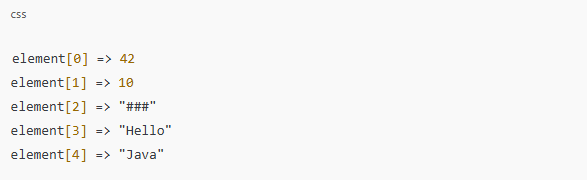
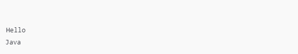

# Uso da classe iterator em java

A Classe iterator vai ser testada no seguinte exercicio:

### Objetivo:
- Fazer com que o método func imprima apenas os elementos da lista que aparecem após uma string especial chamada "###".

### Detalhes:
1. A lista de entrada (ArrayList) contém números inteiros seguidos pela string "###", e depois outros elementos do tipo String.
2. Você precisa modificar o método func para que ele imprima apenas as strings que vêm depois de "###" na lista.
3. A modificação do código requer a edição de no máximo 2 linhas.

Exemplo de Lista: Para uma lista com os seguintes elementos:\

A saída esperada seria:\

